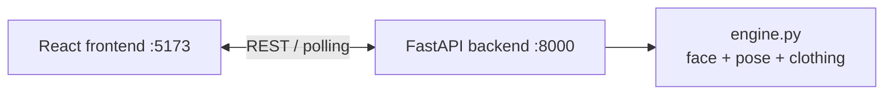
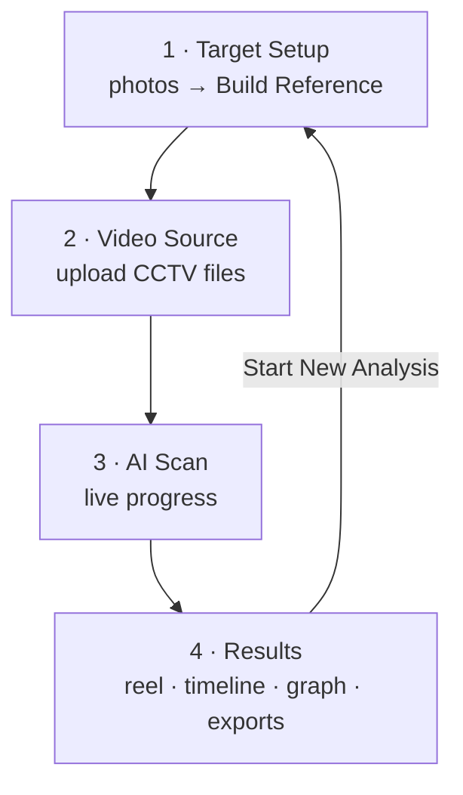
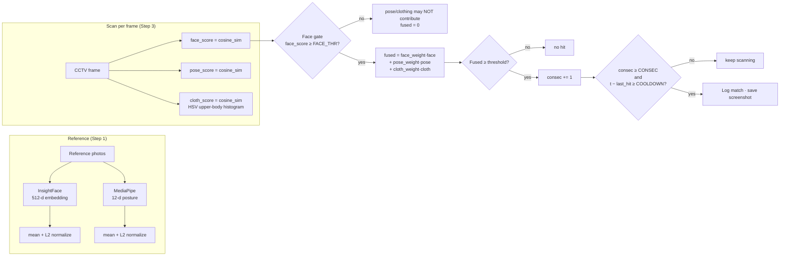
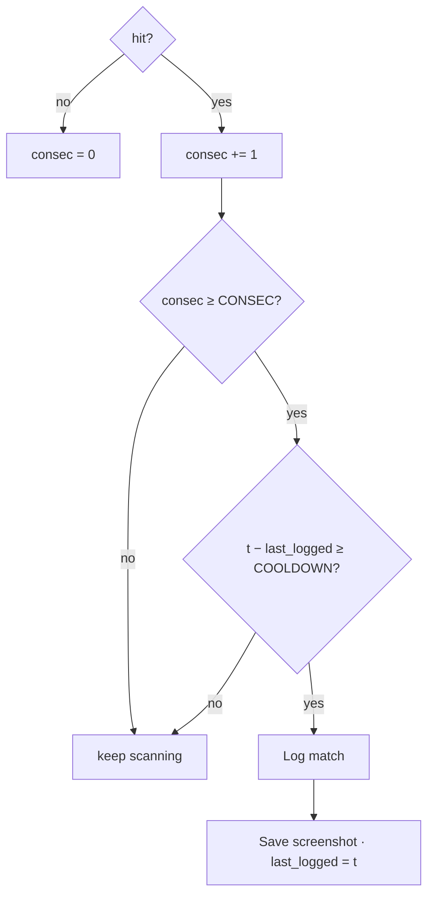

# 🎯 Video Target Identification System

An AI-powered forensic video analysis tool that searches CCTV/surveillance footage for a specific person using **face recognition** (InsightFace) corroborated by a **body-pose snapshot** (MediaPipe) and an **upper-body clothing descriptor** — served by a FastAPI backend with a React (TanStack) frontend, plus a legacy Streamlit web app and two headless CLI scripts.

> **Purpose:** given 1–5 reference photos of a target person, scan one or more CCTV clips and report every sighting — timestamped, scored, screenshot-evidenced, and exported as CSV / PDF / ZIP / annotated videos / a highlight reel.

---

## ✨ Features

- **Face recognition** — InsightFace `buffalo_l` model pack (SCRFD `det_10g` detector + ResNet50 `w600k_r50` recogniser) produces L2-normalized 512-dimensional embeddings from reference photos and from every scanned frame — with an auto-fallback to `buffalo_s` if the big pack isn't installed.
- **Pose corroboration** — MediaPipe extracts 33 body landmarks → a compact 12-dimensional posture descriptor (joint angles + limb ratios + torso-normalized offsets). This is a **single-frame posture snapshot, not gait/temporal analysis** — it is a secondary signal that can nudge a match but can never carry one.
- **Clothing corroboration** — an HSV histogram over the upper-body region below the face (8×8×8 bins, L2-normalized) compares the target's attire against each frame. Same clothing supports a face match; a different outfit drags the fused score down. Capped at 0.10 weight — clothing **cannot** identify someone on its own.
- **Continuous target tracking** — once the target clears the gate, the tracking box is locked onto them and **kept on the screen** across every annotated frame (velocity-extrapolated through brief flickers/occlusions) rather than appearing only at hit moments. When they leave frame for a few seconds, the sighting is closed; when they reappear, they're matched again against the live-refined identity.
- **Live profile learning** — while the target is visible, their clearest face embeddings, actual posture, and **observed upper-body clothing** continuously refine the in-memory reference (`REFINE_MEM_POOL` recent views). Re-acquisition and later videos in the batch therefore match against *who he actually is in this footage*, not just the initial photos. On completion a refined `.npz` profile can be downloaded so a future scan starts smarter, and the report lists the observed clothing colours.
- **Capped evidence** — instead of a screenshot per hit, only the `MAX_EVIDENCE_SHOTS` (=5) strongest sightings keep an evidence frame (the rest are deleted).
- **Fused confidence score** — `fused = face_weight · face_score + pose_weight · pose_score + cloth_weight · cloth_score` (weights sum to 1, clothing capped at 0.10). Face weight is clamped to 0.70–1.0 so pose/clothing can only nudge.
- **Match gating** — a frame only counts after it clears a **face gate**, produces a fused score above the threshold, fires for **N consecutive frames**, and is outside the per-event **cooldown window**.
- **Multi-video batch scanning** — upload multiple MP4 / AVI / MOV / MKV files (or scan a folder headlessly via CLI).
- **Annotated preview videos** — every source is re-encoded with live tracking boxes; upgraded to browser-friendly H.264 via a bundled ffmpeg (`imageio-ffmpeg`), best-effort.
- **Highlight reel** — auto-concatenates each sighting (with context padding) into a single clip, normalizing resolution **and frame rate** so sources with different fps still play at the correct speed.
- **Evidence export** — PDF report, CSV log, evidence ZIP, annotated-video ZIP, per-match high-confidence screenshots.
- **Privacy-first by design** — consent checkbox before analysis, per-scan temporary directories, best-effort cleanup.

---

## 🗂️ Repository Layout

Runtime data (`backend/data/`, `models_cache/`, `outputs/`) is **not committed** — it is created at runtime (see table below). `frontend/node_modules` and build output are gitignored too.

```
video-target-id/
├── backend/                 # FastAPI service + ML pipeline (primary)
│   ├── main.py              # REST API: reference · uploads · scans · exports
│   ├── engine.py            # analysis engine (framework-free, background threads)
│   ├── face_module.py       # InsightFace wrapper (buffalo_l, 512-d embeddings, cosine sim)
│   ├── pose_module.py       # MediaPipe pose embedder (12-d posture descriptor)
│   ├── constants.py         # Shared thresholds, fusion weights, CLI auth flag
│   ├── build_reference.py   # CLI — build a reference profile from photos/videos
│   ├── search_cctv.py       # CLI — batch-scan a folder of CCTV videos
│   └── data/                # runtime uploads/scans/reference (gitignored)
├── frontend/                # React (TanStack Start) UI — talks to backend/ via REST
│   ├── src/lib/api.ts       # API layer (only file that touches fetch())
│   ├── src/lib/types.ts     # Wire contract shared with the backend
│   ├── src/routes/          # 4-step wizard: /, /source, /scan, /results
│   └── package.json
├── app.py                   # LEGACY Streamlit app (same pipeline, older UI)
├── requirements.txt         # Pinned Python dependencies (backend + legacy)
├── .devcontainer/           # GitHub Codespaces / VS Code Remote dev container
│   └── devcontainer.json
├── .gitignore
├── .gitattributes           # Git LFS wiring for model weights (*.onnx)
└── README.md
```

| Path | Git | When it appears | What it holds |
|------|-----|-----------------|---------------|
| `models_cache/models/buffalo_{l,s}/` | ignored | first run (auto-download) | InsightFace model weights |
| `backend/data/uploads/` | ignored | video upload via API | uploaded source footage |
| `backend/data/scans/<scan_id>/` | ignored | a scan starts | annotated videos, screenshots, highlight reel |
| `backend/data/reference/` | ignored | reference build | transient reference photo cache |
| `outputs/reference_profile.json` | ignored | `build_reference.py` runs | CLI reference profile (raw biometrics — handle with care) |
| `outputs/detections.csv` | ignored | `search_cctv.py` runs | CLI scan results |
| `outputs/crops/` | ignored | `search_cctv.py` runs | CLI evidence crops |

### Streamlit runtime artifacts (web app)

During an app session, temp videos and evidence live under your OS temp dir, namespaced per session:

```
<temp>/target_id_screens/<session_id>/
├── annotated/<name>_annotated.mp4        # per-source annotated videos (mp4v)
├── annotated/<name>_annotated_h264.mp4   # H.264-upgraded copy (when ffmpeg is available)
├── highlight_reel.mp4                    # concatenated sightings
├── highlight_reel_h264.mp4               # browser-friendly copy
└── match_<session_id>_<video>_<ts>.jpg   # evidence screenshots
```

These are removed by “🔄 New Case” / “🔄 Start New Analysis” (best-effort). Uploaded CCTV files are copied to temp on upload and deleted on reset.

---

## ⚙️ Installation

### Prerequisites

- **Python 3.10–3.11** (dev container uses 3.11)
- **ffmpeg** on `PATH` (optional — the app falls back to the `imageio-ffmpeg` bundled binary; without either, it skips the H.264 upgrade and keeps mp4v files)
- Uses `opencv-python-headless` (no `libgl1` required for deployment)

### 1. Clone

```bash
git clone https://github.com/RishabhPR77/video-target-id.git
cd video-target-id
```

### 2. Create a virtual environment

```bash
python -m venv .venv
```

| OS        | Activate                              |
|-----------|---------------------------------------|
| Windows   | `.\.venv\Scripts\Activate.ps1`        |
| macOS/Linux | `source .venv/bin/activate`         |

### 3. Install dependencies

```bash
pip install -r requirements.txt
```

> **GPU users:** swap `onnxruntime` for `onnxruntime-gpu` in `requirements.txt` for faster inference.

### 4. Models (automatic)

InsightFace downloads the `buffalo_l` weights into `models_cache/` on first run (~270 MB total) — no manual step. If the download fails or a stricter model is wanted, override via environment variables at launch:

| Variable | Default | Effect |
|----------|---------|--------|
| `FACE_MODEL` | `buffalo_l` | InsightFace pack; falls back to `buffalo_s` if unavailable |
| `FACE_DET_SIZE` | `896,896` | Detector inference size — larger finds smaller faces (slower) |
| `FACE_DET_THRESH` | `0.4` | Detector confidence floor — lower recovers blurry/occluded faces |

### Optional: GitHub Codespaces / dev container

The repo ships a `.devcontainer/` — open it in Codespaces or VS Code Remote to get Python 3.11, the system libs, and an auto-forwarded app on port `8501`.

> ⚠️ The dev container's launch command disables CORS/XSRF for **ephemeral local iteration only**. Do not copy those flags into a real deployment — use Streamlit's secure defaults instead.

---

## 🚀 Usage

### Option A — React frontend + FastAPI backend (recommended)

Start the backend (from the repo root):

```bash
uvicorn backend.main:app --host 0.0.0.0 --port 8000
```

Install and start the frontend (Node 20+ / npm):

```bash
cd frontend
npm install
npm run dev
```

Open the Vite dev URL (default `http://localhost:5173`). The frontend calls the backend at `http://localhost:8000` by default; override with `VITE_API_BASE` (e.g. `.env.local` with `VITE_API_BASE=https://api.example.com`) if they're not co-hosted.



| Step | What you do |
|------|-------------|
| **1 – Target Setup** | Drop 1–5 front-facing reference photos → **Build Reference**. Optional **Save Profile** downloads the embeddings as `.npz`. Tick the authorisation checkbox, then **Next**. |
| **2 – Video Source** | Drop one or more CCTV files (MP4 / AVI / MOV / MKV) → **Next**. |
| **3 – AI Scan** | Watch live progress; matched frames stream in as they're found → **View Results** |
| **4 – Results** | Inspect the highlight reel + per-source annotated videos, match timeline, confidence graph, screenshots; download CSV / PDF / evidence / highlighted ZIPs. Play a sighting to seek straight to it in the annotated clip. |



### Option B — Streamlit web app (legacy)

The original single-file UI still runs the same pipeline:

```bash
streamlit run app.py
```

Follow the 4-step wizard in your browser (`localhost:8501`).

### Option C — CLI scripts (headless)

The CLI scripts are independent of the web app — they read `data/` and `outputs/` in the repo root (run them **from the repo root**) and write to `outputs/`. Both require the **authorisation flag** and refuse to run without it.

```bash
# 1) prepare your input folders
mkdir -p data/reference_photos data/cctv_videos
#    (drop reference pictures / CCTV videos into them)

# 2) build the reference profile
python backend/build_reference.py --i-am-authorized

# 3) scan a folder of CCTV videos
python backend/search_cctv.py --i-am-authorized
```

| Script | Reads | Writes |
|--------|-------|--------|
| `backend/build_reference.py` | `data/reference_photos/` (any image) + optional `data/reference_videos/` (stride 5) | `outputs/reference_profile.json` |
| `backend/search_cctv.py` | `outputs/reference_profile.json` + `data/cctv_videos/*.*` (stride 3) | `outputs/detections.csv`, `outputs/crops/*.jpg` |

---

## 🧠 How It Works

### Pipeline



### Score math

```
face_score  = cosine_sim(face_embedding_512d, reference_face_embedding)
pose_score  = cosine_sim(pose_descriptor_12d, reference_pose_descriptor)
cloth_score = cosine_sim(HSV_histogram_512d, reference_clothing_histogram)

fused = face_weight · face_score                                # weights sum to 1
      + pose_weight  · pose_score   (pose_weight = 1 − face − cloth, ≥ 0)
      + cloth_weight · cloth_score  (cloth_weight = min(0.10, 1 − face))

hit  = (face_score ≥ FACE_THR) AND (fused ≥ threshold)          # pose/clothing only
                                                                 # help after the face gate
```

### Match decision



### Pose & clothing caveats (important)

- `pose_module.py` produces a **single-frame posture snapshot**, not temporal gait analysis — two people standing in a similar posture produce nearly identical descriptors. Pose is therefore only a corroborating signal and is gated by `FACE_THR`; the face embedding remains the identity anchor.
- The **clothing descriptor** (HSV histogram of the upper-body region below the face) works the same way: it supports a face match when the outfit matches and drags the score down when it doesn't, but **identical clothing alone cannot identify anyone** — the face gate must clear first, and clothing weight is capped at 0.10.

---

## 🔧 Configuration

### Shared constants — `constants.py`

| Constant | Default | Description |
|----------|---------|-------------|
| `FACE_THR` | `0.42` | Minimum face cosine-similarity for a frame to count toward a hit |
| `FUSED_THR` | `0.45` | Minimum fused score in the CLI scanner (`search_cctv.py`) |
| `CONSEC` | `3` | Consecutive qualifying frames required before logging / (re)acquisition |
| `COOLDOWN` | `2.0 s` | Minimum gap in seconds between logged hits |
| `REACQUIRE_GAP` | `4.0 s` | Target unseen this long → close the sighting; they're searched for again |
| `MIN_SIGHTING_SECS` | `0.4 s` | Shorter tracks (flicker) are discarded |
| `MAX_EVIDENCE_SHOTS` | `5` | Keep only the N strongest evidence screenshots per scan |
| `W_FACE` / `W_POSE` | `0.80` / `0.20` | CLI scanner fusion weights |
| `W_CLOTH` / `CLOTH_WEIGHT_CAP` | `0.10` | Clothing corroboration weight; when a scan uses a custom face weight, cloth is capped at `min(0.10, 1 − face)` and pose gets the remainder |
| `AUTH_FLAG` | `--i-am-authorized` | Gate required by both CLI scripts |

### Streamlit UI — sidebar controls

| Control | Default | Notes |
|---------|---------|-------|
| Detection Threshold | `0.45` | Slider 0.30–0.95; the app's fused-score cut-off (mirrors `FUSED_THR` for CLI) |
| Face Weight | `0.80` | Slider 0.70–1.0 (pose = `1 − face`), so pose can only ever nudge |
| Frame Skipping | `2` | Slider 0–60; skips **detection only** — annotated videos are always written at full frame rate |
| Scan Resolution | `Medium (640px)` | `Low (320px)` / `Medium (640px)` / `High (1280px, capped)` |
| Frame Skip (CLI only) | `3` | `FRAME_STRIDE` in `search_cctv.py` |

---

## 📦 Dependencies

| Package | Purpose |
|---------|---------|
| `fastapi` | REST API for the React frontend |
| `uvicorn[standard]` | ASGI server for `backend/main.py` |
| `python-multipart` | Multipart uploads (reference photos, video files) |
| `streamlit` | Legacy web UI (`app.py`) |
| `insightface` | Face detection & `buffalo_l` recognition (512-d embeddings) |
| `onnxruntime` | InsightFace inference backend |
| `mediapipe` | Pose landmark extraction → 12-d posture descriptor |
| `opencv-python-headless` | Video I/O and image processing |
| `numpy` | Array math (pinned `<2` for insightface/mediapipe compatibility) |
| `pandas` | Match timeline & results tables (legacy UI + CLI) |
| `altair` | Confidence-over-time chart (legacy UI) |
| `fpdf2` | PDF report generation |
| `imageio-ffmpeg` | Bundled ffmpeg binary for mp4v → H.264 transcoding |
| `tqdm` | CLI progress bars |
| `protobuf` | MediaPipe dependency (pinned for compatibility) |
| `Pillow`, `scikit-learn` | Installed; used by the ecosystem (no direct imports in the pipeline code) |

---

## 🔒 Legal & Ethical Notice

This tool is intended for **authorized forensic and security use only**. Processing biometric data without the subject's consent or appropriate legal authority may be illegal in your jurisdiction. The app enforces an authorisation checkbox before analysis (Step 1), and both CLI scripts exit unless run with `--i-am-authorized`.

**Because face recognition can misidentify people, treat every match as a lead requiring human verification — not as proof of identity.**

---

## 🔐 Data Handling

The biometrics this tool produces are **raw, unencrypted embeddings of identifiable persons**:

- `backend/data/scans/<scan_id>/` — match screenshots (raw face crops) + annotated videos, created per scan via the API.
- `backend/data/uploads/` — uploaded source footage, kept until the process exits.
- `outputs/reference_profile.json` — written by the CLI `backend/build_reference.py` (JSON arrays of `{"face": […], "pose": […]}`).
- `.npz` profiles — downloaded via the app's **Save Profile** button.
- `outputs/crops/*.jpg` — CLI evidence crops, also unencrypted.

Operators must:
- **Store and access-control these files as sensitive biometric data** under their own jurisdiction's legal obligations.
- **Delete them when no longer needed** (see `backend/data/`, `outputs/`, and the `<temp>/target_id_screens/<session_id>/` legacy folder).
- **Never commit them to version control, email them, or place them on unprotected storage.**

This tool provides **no encryption-at-rest**. `backend/data/`, `outputs/`, `models_cache/` and `*.npz` are gitignored, but protecting them is your responsibility (encrypted volumes, OS-level encryption, etc.).

---

## 📄 License

MIT. (A `LICENSE` file is not yet included in the repository.)