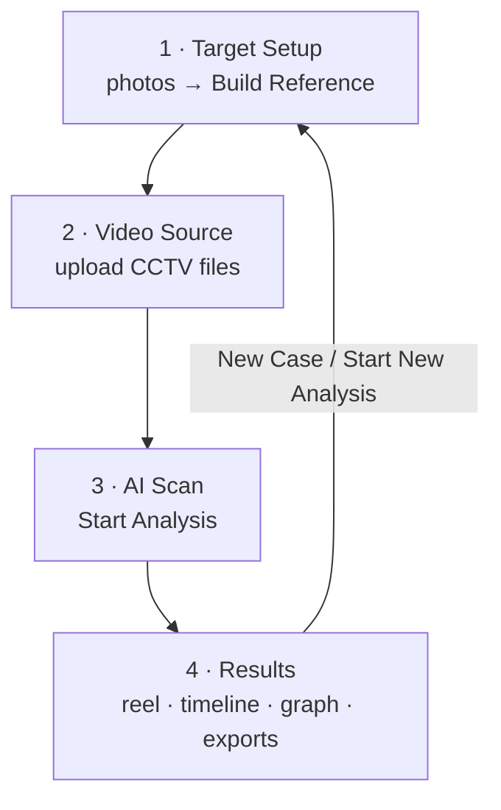
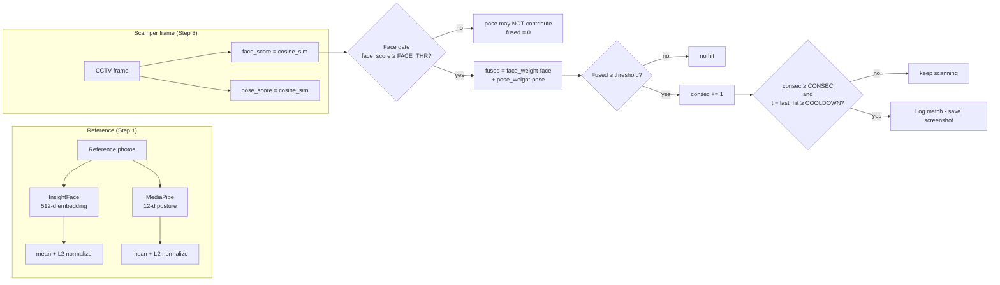
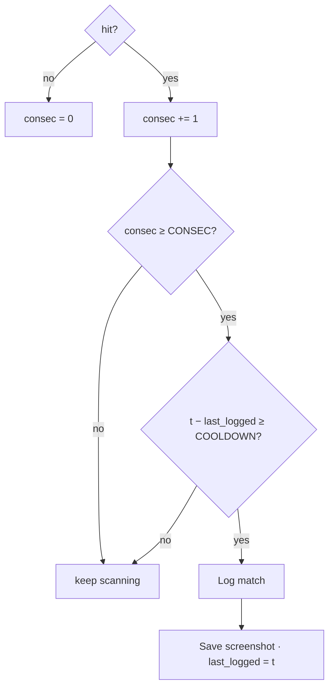

# 🎯 Video Target Identification System

An AI-powered forensic video analysis tool that searches CCTV/surveillance footage for a specific person using **face recognition** (InsightFace) corroborated by a **body-pose snapshot** (MediaPipe) — all wrapped in a Streamlit web app plus two headless CLI scripts.

> **Purpose:** given 1–5 reference photos of a target person, scan one or more CCTV clips and report every sighting — timestamped, scored, screenshot-evidenced, and exported as CSV / PDF / ZIP / annotated videos / a highlight reel.

---

## ✨ Features

- **Face recognition** — InsightFace `buffalo_s` model produces L2-normalized 512-dimensional embeddings from reference photos and from every scanned frame.
- **Pose corroboration** — MediaPipe extracts 33 body landmarks → a compact 12-dimensional posture descriptor (joint angles + limb ratios + torso-normalized offsets). This is a **single-frame posture snapshot, not gait/temporal analysis** — it is a secondary signal that can nudge a match but can never carry one.
- **Fused confidence score** — `fused = W_FACE · face_score + W_POSE · pose_score`, adjustable live in the sidebar (face weight clamped to a 0.70–1.0 range so pose never dominates).
- **Match gating** — a frame only counts after it clears a **face gate**, produces a fused score above the threshold, fires for **N consecutive frames**, and is outside the per-event **cooldown window**.
- **Multi-video batch scanning** — upload multiple MP4 / AVI / MOV / MKV files (or scan a folder headlessly via CLI).
- **Annotated preview videos** — every source is re-encoded with live tracking boxes; upgraded to browser-friendly H.264 via a bundled ffmpeg (`imageio-ffmpeg`), best-effort.
- **Highlight reel** — auto-concatenates each sighting (with context padding) into a single clip, normalizing resolution **and frame rate** so sources with different fps still play at the correct speed.
- **Evidence export** — PDF report, CSV log, evidence ZIP, annotated-video ZIP, per-match high-confidence screenshots.
- **Privacy-first by design** — consent checkbox before analysis, per-session temporary directories (`session_id`-namespaced), best-effort cleanup on “New Case”.

---

## 🗂️ Repository Layout

`data/`, `models_cache/` and `outputs/` are **not committed** — they are created at runtime (see table below).

```
video-target-id/
├── app.py                  # Streamlit app — the 4-step wizard + analysis engine
├── face_module.py          # InsightFace wrapper (buffalo_s, 512-d embeddings, cosine sim)
├── pose_module.py          # MediaPipe pose embedder (12-d posture descriptor)
├── constants.py            # Shared thresholds, fusion weights, CLI auth flag
├── build_reference.py      # CLI — build a reference profile from photos/videos
├── search_cctv.py          # CLI — batch-scan a folder of CCTV videos
├── requirements.txt        # Pinned Python dependencies
├── .devcontainer/          # GitHub Codespaces / VS Code Remote dev container
│   └── devcontainer.json
├── .gitignore
├── .gitattributes          # Git LFS wiring for model weights (*.onnx)
└── README.md
```

| Path | Git | When it appears | What it holds |
|------|-----|-----------------|---------------|
| `models_cache/models/buffalo_s/` | ignored | first run (auto-download) | InsightFace model weights |
| `data/reference_photos/` | ignored | you create it | CLI reference photos |
| `data/reference_videos/` | ignored | optional | CLI reference walking clips |
| `data/cctv_videos/` | ignored | you create it | CLI scan input |
| `outputs/reference_profile.json` | ignored | `build_reference.py` runs | CLI reference profile (raw biometrics — handle with care) |
| `outputs/detections.csv` | ignored | `search_cctv.py` runs | CLI scan results |
| `outputs/crops/` | ignored | `search_cctv.py` runs | CLI evidence crops |

### Streamlit runtime artifacts (web app)

During an app session, temp videos and evidence live under your OS temp dir, namespaced per session:

```
<temp>/target_id_screens/<session_id>/
├── annotated/<name>_annotated.mp4        # per-source annotated videos (mp4v)
├── annotated/<name>_annotated_h264.mp4   # H.264-upgraded copy (when ffmpeg is available)
├── highlight_reel.mp4                    # concatenated sightings
├── highlight_reel_h264.mp4               # browser-friendly copy
└── match_<session_id>_<video>_<ts>.jpg   # evidence screenshots
```

These are removed by “🔄 New Case” / “🔄 Start New Analysis” (best-effort). Uploaded CCTV files are copied to temp on upload and deleted on reset.

---

## ⚙️ Installation

### Prerequisites

- **Python 3.10–3.11** (dev container uses 3.11)
- **ffmpeg** on `PATH` (optional — the app falls back to the `imageio-ffmpeg` bundled binary; without either, it skips the H.264 upgrade and keeps mp4v files)
- Uses `opencv-python-headless` (no `libgl1` required for deployment)

### 1. Clone

```bash
git clone https://github.com/RishabhPR77/video-target-id.git
cd video-target-id
```

### 2. Create a virtual environment

```bash
python -m venv .venv
```

| OS        | Activate                              |
|-----------|---------------------------------------|
| Windows   | `.\.venv\Scripts\Activate.ps1`        |
| macOS/Linux | `source .venv/bin/activate`         |

### 3. Install dependencies

```bash
pip install -r requirements.txt
```

> **GPU users:** swap `onnxruntime` for `onnxruntime-gpu` in `requirements.txt` for faster inference.

### 4. Models (automatic)

InsightFace downloads the `buffalo_s` weights into `models_cache/` on first run — no manual step.

### Optional: GitHub Codespaces / dev container

The repo ships a `.devcontainer/` — open it in Codespaces or VS Code Remote to get Python 3.11, the system libs, and an auto-forwarded app on port `8501`.

> ⚠️ The dev container's launch command disables CORS/XSRF for **ephemeral local iteration only**. Do not copy those flags into a real deployment — use Streamlit's secure defaults instead.

---

## 🚀 Usage

### Option A — Streamlit web app (recommended)

```bash
streamlit run app.py
```

Then follow the 4-step wizard in your browser (`localhost:8501`):

| Step | What you do |
|------|-------------|
| **1 – Target Setup** | Upload 1–5 front-facing reference photos → **⚙️ Build Reference**. Optional **💾 Save Profile** downloads the embeddings as `.npz`. Tick the authorisation checkbox, then **Next**. |
| **2 – Video Source** | Upload one or more CCTV files (MP4 / AVI / MOV / MKV) → **Next**. |
| **3 – AI Scan** | Set frame skipping & scan resolution, then **🚀 Start Analysis**. |
| **4 – Results** | Inspect the highlight reel + per-source annotated videos, match timeline, confidence graph, screenshots; download CSV / PDF / evidence ZIPs. |



### Option B — CLI scripts (headless)

The CLI scripts are independent of the web app — they read from `data/` and write to `outputs/`. Both require the **authorisation flag** and refuse to run without it.

```bash
# 1) prepare your input folders
mkdir -p data/reference_photos data/cctv_videos
#    (drop reference pictures / CCTV videos into them)

# 2) build the reference profile
python build_reference.py --i-am-authorized

# 3) scan a folder of CCTV videos
python search_cctv.py --i-am-authorized
```

| Script | Reads | Writes |
|--------|-------|--------|
| `build_reference.py` | `data/reference_photos/` (any image) + optional `data/reference_videos/` (stride 5) | `outputs/reference_profile.json` |
| `search_cctv.py` | `outputs/reference_profile.json` + `data/cctv_videos/*.*` (stride 3) | `outputs/detections.csv`, `outputs/crops/*.jpg` |

---

## 🧠 How It Works

### Pipeline



### Score math

```
face_score = cosine_sim(face_embedding_512d, reference_face_embedding)
pose_score = cosine_sim(pose_descriptor_12d, reference_pose_descriptor)

fused = face_weight · face_score + pose_weight · pose_score      # weights sum to 1

hit  = (face_score ≥ FACE_THR) AND (fused ≥ threshold)          # pose only helps
                                                                 # after the face gate
```

### Match decision



### Pose caveat (important)

`pose_module.py` produces a **single-frame posture snapshot**, not temporal gait analysis — two people standing in a similar posture produce nearly identical descriptors. Pose is therefore only a corroborating signal and is gated by `FACE_THR`; the face embedding remains the identity anchor.

---

## 🔧 Configuration

### Shared constants — `constants.py`

| Constant | Default | Description |
|----------|---------|-------------|
| `FACE_THR` | `0.42` | Minimum face cosine-similarity for a frame to count toward a hit |
| `FUSED_THR` | `0.48` | Minimum fused score in the CLI scanner (`search_cctv.py`) |
| `CONSEC` | `3` | Consecutive qualifying frames required before logging |
| `COOLDOWN` | `2.0 s` | Minimum gap in seconds between logged hits |
| `W_FACE` / `W_POSE` | `0.80` / `0.20` | Fusion weights used by the CLI scanner |
| `AUTH_FLAG` | `--i-am-authorized` | Gate required by both CLI scripts |

### Streamlit UI — sidebar controls

| Control | Default | Notes |
|---------|---------|-------|
| Detection Threshold | `0.55` | Slider 0.30–0.95; the app's fused-score cut-off (mirrors `FUSED_THR` for CLI) |
| Face Weight | `0.80` | Slider 0.70–1.0 (pose = `1 − face`), so pose can only ever nudge |
| Frame Skipping | `5` | Slider 0–60; skips **detection only** — annotated videos are always written at full frame rate |
| Scan Resolution | `Medium (640px)` | `Low (320px)` / `Medium (640px)` / `High (1280px, capped)` |
| Frame Skip (CLI only) | `3` | `FRAME_STRIDE` in `search_cctv.py` |

---

## 📦 Dependencies

| Package | Purpose |
|---------|---------|
| `streamlit` | Web UI |
| `insightface` | Face detection & `buffalo_s` recognition (512-d embeddings) |
| `onnxruntime` | InsightFace inference backend |
| `mediapipe` | Pose landmark extraction → 12-d posture descriptor |
| `opencv-python-headless` | Video I/O and image processing |
| `numpy` | Array math (pinned `<2` for insightface/mediapipe compatibility) |
| `pandas` | Match timeline & results tables |
| `altair` | Confidence-over-time chart |
| `fpdf2` | PDF report generation |
| `imageio-ffmpeg` | Bundled ffmpeg binary for mp4v → H.264 transcoding |
| `tqdm` | CLI progress bars |
| `protobuf` | MediaPipe dependency (pinned for compatibility) |
| `Pillow`, `scikit-learn` | Installed; used by the ecosystem (no direct imports in the pipeline code) |

---

## 🔒 Legal & Ethical Notice

This tool is intended for **authorized forensic and security use only**. Processing biometric data without the subject's consent or appropriate legal authority may be illegal in your jurisdiction. The app enforces an authorisation checkbox before analysis (Step 1), and both CLI scripts exit unless run with `--i-am-authorized`.

**Because face recognition can misidentify people, treat every match as a lead requiring human verification — not as proof of identity.**

---

## 🔐 Data Handling

The biometrics this tool produces are **raw, unencrypted embeddings of identifiable persons**:

- `outputs/reference_profile.json` — written by the CLI `build_reference.py` (JSON arrays of `{"face": […], "pose": […]}`).
- `.npz` profiles — downloaded via the app's **💾 Save Profile** button.
- `outputs/crops/*.jpg` and match screenshots — raw face images, also unencrypted.

Operators must:
- **Store and access-control these files as sensitive biometric data** under their own jurisdiction's legal obligations.
- **Delete them when no longer needed** (see `outputs/` and the `<temp>/target_id_screens/<session_id>/` folder).
- **Never commit them to version control, email them, or place them on unprotected storage.**

This tool provides **no encryption-at-rest**. `data/`, `outputs/`, `models_cache/` and `*.npz` are gitignored, but protecting them is your responsibility (encrypted volumes, OS-level encryption, etc.).

---

## 📄 License

MIT. (A `LICENSE` file is not yet included in the repository.)